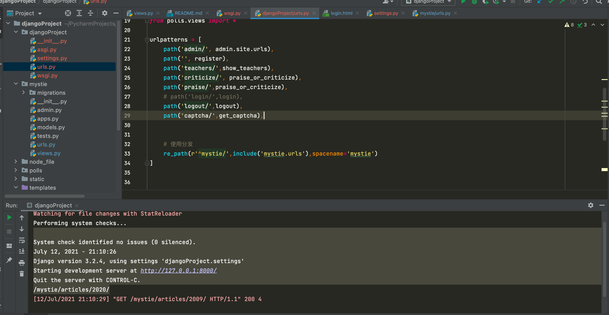

# PythonWeb框架Django

### 安装django
   ``` 
   pip install django==2.2.13
   ```
### 查看django
   ``` 
   django-admin --version
   ```

### 安装app
  ```  
  python manage.py startapp first
  ```  
### 启动django
  ```  
  python manage.py runserver
  ```

### 目录结构


### 配置文件settings.py
  ```  
    SESSION_COOKINE_AGE=1209600    session过期时间秒
    SESSION_EXPIRE_AT_BROWSER_CLOSE = True  True在关闭浏览器窗口session就过期
    # 配置将会话对象放到缓存中存储
    SESSION_ENGINE = 'django.contrib.sessions.backends.cache'
    # 配置使用哪一组缓存来保存会话
    SESSION_CACHE_ALIAS = 'default'
    SESSION_SERIALIZER = 'django.contrib.sessions.serializers.PickleSerializer'
```
```Python
# 配置数据库
DATABASES = {
    'default': {
        #数据库引擎配置
        'ENGINE': 'django.db.backends.mysql',
        #数据库的名字
        'NAME':'vote',
        #数据库服务器ip地址
        'HOST':'47.98.101.50',
        #启动Mysql服务端口号
        'PORT':'3306',
        #数据库用户名和口令
        'USER':'hellokitty',
        'PASSWORD':'Hellokitty.618',
        #数据库使用的字符集
        'CHARSET':'utf8',
        #数据库时间日期的时区设置
        'TIME_ZONE':'Asia/ChongQing',
    }
}

# 地区
LANGUAGE_CODE = 'zh-hans'
TIME_ZONE = 'Asia/Chongqing'

# 配置静态文件
STATICFILES_DIRS = [os.path.join(BASE_DIR, 'static'), ]
STATIC_URL = '/static/'
```

### 路由配置：
```python
urlpatterns = [
    path('hello/', views.show_index),
    path('time/',views.get_time),


    # 带正则的请求
    # 已articles开头/4位0-9数字组成结尾
    re_path(r'^articles/([0-9]{4})/$',views.year_archive),
    # 给参数设置名字 ?P<year>
    re_path(r'^articles/(?P<year>[0-9]{4})/(?P<month>[0-9]{2})/$',views.year_month),
    re_path(r'^articles/([0-9]{4})/([0-9]{2})/([0-31]{2})/$',views.year_month_day),
]


```


### URL分发
#### url.py
```Python
urlpatterns = [
    path('admin/', admin.site.urls),
    path('', register),
    path('teachers/',show_teachers),
    path('criticize/', praise_or_criticize),
    path('praise/',praise_or_criticize),
    path('login/',login),
    path('logout/',logout),
    path('captcha/',get_captcha),
    re_path(r'^',include('mystie.urls'))
]

# 应用中urls.py
urlpatterns = [
    path('hello/', views.show_index),
    path('time/',views.get_time),


    # 带正则的请求
    # 已articles开头/4位0-9数字组成结尾
    re_path(r'^articles/([0-9]{4})/$',views.year_archive),
    # 给参数设置名字 ?P<year>
    re_path(r'^articles/(?P<year>[0-9]{4})/(?P<month>[0-9]{2})/$',views.year_month),
    re_path(r'^articles/([0-9]{4})/([0-9]{2})/([0-31]{2})/$',views.year_month_day),
]

```

#### views.py
```Python
def show_index(request):
    fruits =[
        'Apple','Orange','Pitaya','Durian','Mango','Pear','Peach','Grape'
    ]

    selected_fruits = sample(fruits,3)
    #第一个参数request对象
    #第二个参数返回需要渲染静态网页名字
    #第三个返回需要渲染到页面数据
    return render(request, 'mystie/index.html', {'fruits':selected_fruits})

def get_time(request):
    time = datetime.now()
    return render(request,'mystie/time.html',{'time':time})
```

#### models.py
```python
class User(models.Model):
    no = models.AutoField(primary_key=True,verbose_name='编号')
    username = models.CharField(max_length=20, unique=True, verbose_name='用户名')
    password = models.CharField(max_length=32,verbose_name='密码')
    tel = models.CharField(max_length=20, verbose_name='手机号')
    reg_date = models.DateTimeField(auto_now_add=True, verbose_name='注册时间')
    last_visit = models.DateTimeField(null=True, verbose_name='最后登录时间')

    class Meta:
        db_table = 'tb_user'
        verbose_name = '用户'
        verbose_name_plural = '用户'
```

### URL反向解析
    1、定义：
        随着功能的增加会出现更多的视图，可能之前配置的正则表达式不够准确，于是就要修改正则表达式，但是正则表达式一旦修改了，之前所有对应的超链接
        都要修改，真是一件麻烦的事情，而且可能还会漏掉一些超链接忘记修改，有办法让链接根据正则表达式动态生成吗？ 就是用反向解析的办法。
    
    2、使用方法：
        定义url时，需要为include定义namespace属性，为url定义name属性
        使用时，在模板中使用url标签，在视图中使用reverse函数，根据正则表达式动态生成地址，减轻后期维护成本。

#### 在项目urls.py中为include定义namespace属性。
``` python
url(r’^’,include(‘mystie.urls’,namespace=’mystie’)),
```



#### 在应用的urls.py中为url定义name属性，并修改为ye。
``` python
re_path(r'^articles/([0-9]{4})/$',views.year_archive,name='ye'),
 ```    


#### 在html模版中使用URL别名
 ```  html
 <form action= method="post">
        <div>
            <label for="username">用户名</label>
            <input name="username" type="text" >
        </div>
        <div>
            <label for="password">密码</label>
            <input type="password" name="pwd">
        </div>
        <div class="c3-1">
            <input type="submit" value="登录">
        </div>
    </form> 
 ```   
### 在视图中使用重定向传递位置参数
```   python
    from django.shortcuts import render
    
    def year_archive(request,year):
        #使用重定向传递位置参数
        url = reverse('ye',args=(2020,))
        print(url)
        return HttpResponse(year)
 ```   
### mysql驱动
  ``` 
   pip install pymysql
    以上配置，一定要注意键名：NAME、USER、PASSWORD……  都一定是大写，否则数据验证会失败。
    我的【NAME】，写成了【Name】导致数据连接时提示：找不到这个数据库 。
    然后通过pip 安装pymysql ：pip install pymysql
    再在项目配置目录里的init.py文件中写入：
        import pymysql
        pymysql.install_as_MySQLdb()
    执行python manage.py makemigrations
        python manage.py makemigra
    再运行服务，应该是可以启动django服务的。
   ```

### ORM来解决数据持久化问题
  ```  
    使用ORM是为了实现对象模型到关系模型的双向转换，这样就不用在Python代码中书写SQL语句和游标操作，因为这些都会由ORM自动完成。
    利用Django的ORM，我们可以直接将刚才创建的学科表和老师表变成Django中的模型类
    python manage.py inspectdb > polls/models.py
   ```

#使用orm模型完成CRUD
   ``` 
    python manage.py shell
   ```

```python
from polls.models import Subject

subject1 = Subject(name='Python全栈开发', intro='当下最热门的学科', is_hot=True)
subject1.save()
subject2 = Subject(name='全栈软件测试', intro='学习自动化测试的学科', is_hot=False)
subject2.save()
subject3 = Subject(name='JavaEE分布式开发', intro='基于Java语言的服务器应用开发', is_hot=True)
删除
subject = Subject.objects.get(no=2)
subject.delete()
更新
subject = Subject.objects.get(no=1)
subject.name = 'Python全栈+人工智能'
subject.save()
查询
查询所有对象。
Subjects.objects.all()
过滤数据。
# 查询名称为“Python全栈+人工智能”的学科
Subject.objects.filter(name='Python全栈+人工智能')

# 查询名称包含“全栈”的学科（模糊查询）
Subject.objects.filter(name__contains='全栈')
Subject.objects.filter(name__startswith='全栈')
Subject.objects.filter(name__endswith='全栈')

# 查询所有热门学科
Subject.objects.filter(is_hot=True)

# 查询编号大于3小于10的学科
Subject.objects.filter(no__gt=3).filter(no__lt=10)
Subject.objects.filter(no__gt=3, no__lt=10)

# 查询编号在3到7之间的学科
Subject.objects.filter(no__ge=3, no__le=7)
Subject.objects.filter(no__range=(3, 7))
查询单个对象。
# 查询主键为1的学科
Subject.objects.get(pk=1)
Subject.objects.get(no=1)
Subject.objects.filter(no=1).first()
Subject.objects.filter(no=1).last()
排序。
# 查询所有学科按编号升序排列
Subject.objects.order_by('no')
# 查询所有部门按部门编号降序排列
Subject.objects.order_by('-no')
切片（分页查询）。
# 按编号从小到大查询前3个学科
Subject.objects.order_by('no')[:3]
计数。
# 查询一共有多少个学科
Subject.objects.count()
高级查询。
# 查询编号为1的学科的老师
Teacher.objects.filter(subject__no=1)
Subject.objects.get(pk=1).teacher_set.all()

# 查询学科名称有“全栈”二字的学科的老师
Teacher.objects.filter(subject__name__contains='全
```
### Django模型最佳实践
```
    正确的为模型和关系字段命名。
    设置适当的related_name属性。
    用OneToOneField代替ForeignKeyField(unique=True)。
    通过“迁移操作”（migrate）来添加模型。
    用NoSQL来应对需要降低范式级别的场景。
    如果布尔类型可以为空要使用NullBooleanField。
    在模型中放置业务逻辑。
    用<ModelName>.DoesNotExists取代ObjectDoesNotExists。
    在数据库中不要出现无效数据。
    不要对QuerySet调用len()函数。
    将QuerySet的exists()方法的返回值用于if条件。
    用DecimalField来存储货币相关数据而不是FloatField。
    定义__str__方法。
    不要将数据文件放在同一个目录中。
```
### 实现用户跟踪
```
    URl重写：所谓URL重写就是在URL中携带sessionid
    隐藏域：在提交表单时，通过表单中设置隐藏域向服务器发送数据
        <input type="hidden" name="sessionid" value="123456">
    本地存储
        Local Storage
        Session Storage
        IndexedDB
        Web SQL
        Cookies
```

### 数据库操作
```sql
show databases ;
use information_schema;
use vote;
show tables ;

select * from tb_subject;
select * from tb_teacher;
select * from tb_user;

insert into `tb_user`
    (`username`,`password`,`tel`,`reg_date`)
values
    ('wangdachui', '1c63129ae9db9c60c3e8aa94d3e00495', '13122334455', now()),
    ('hellokitty', 'c6f8cf68e5f68b0aa4680e089ee4742c', '13890006789', now());
```