# PythonWeb框架Django

###### Django是一个开放源代码的Web应用框架，由Python写成,采用了MTV的框架模式.即Model,View,Template组成.许多成功的网站和APP都基于Django， 说到底,其实Django内部就是对 Socket 连接的强大封装.

一、 Django流程介绍

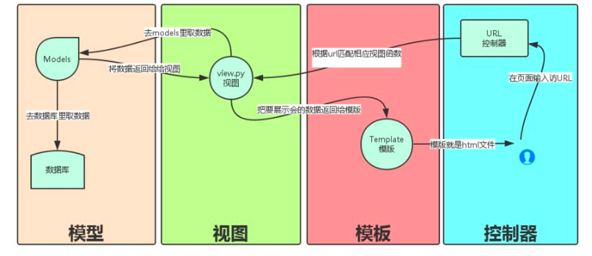

#### MVC是众所周知的模式，即：将应用程序分解成三个组成部分:model(模型),view(视图),和 controller(控制 器)。其中：
    M——管理应用程序的状态（通常存储到数据库中），并约束改变状态的行为（或者叫做“业务规则”）。
    
    C——接受外部用户的操作，根据操作访问模型获取数据，并调用“视图”显示这些数据。控制器是将“模型”和“视图”隔离，并成为二者之间的联系纽带。
    
    V——负责把数据格式化后呈现给用户。

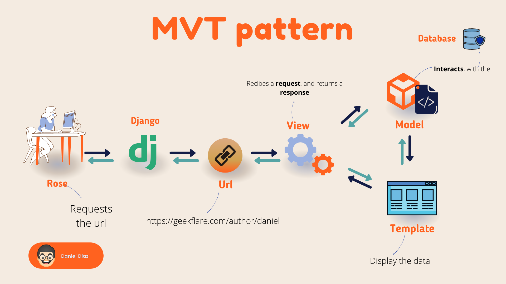

Django也是一个MVC框架。但是在Django中，控制器接受用户输入的部分由框架自行处理，所以 Django 里更关注的是模型（Model）、模板(Template)和视图（Views），称为 MTV模式：

    M 代表模型（Model），即数据存取层。 该层处理与数据相关的所有事务： 如何存取、如何验证有效性、包含哪些行为以及数据之间的关系等。

    T 代表模板(Template)，即表现层。 该层处理与表现相关的决定： 如何在页面或其他类型文档中进行显示。

    V 代表视图（View），即业务逻辑层。 该层包含存取模型及调取恰当模板的相关逻辑。 你可以把它看作模型与模板之间的桥梁。


### 安装django
   ``` 
   pip install django==2.2.13
   ```

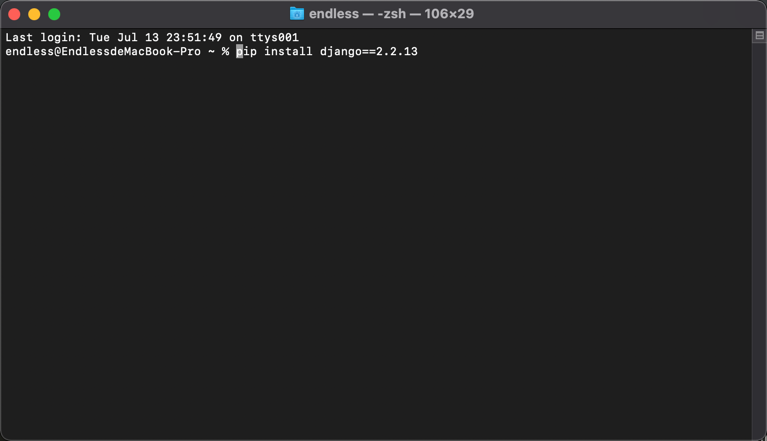

#### 查看django
   ``` 
   pip3 show django  查看django安装路径
   django-admin --version
   ```

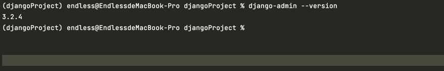

#### 创建django项目
    django-admin startproject mysite

#### 创建app
  ```  
  python manage.py startapp first
  ```  
#### 启动django
  ```  
  python manage.py runserver
  ```

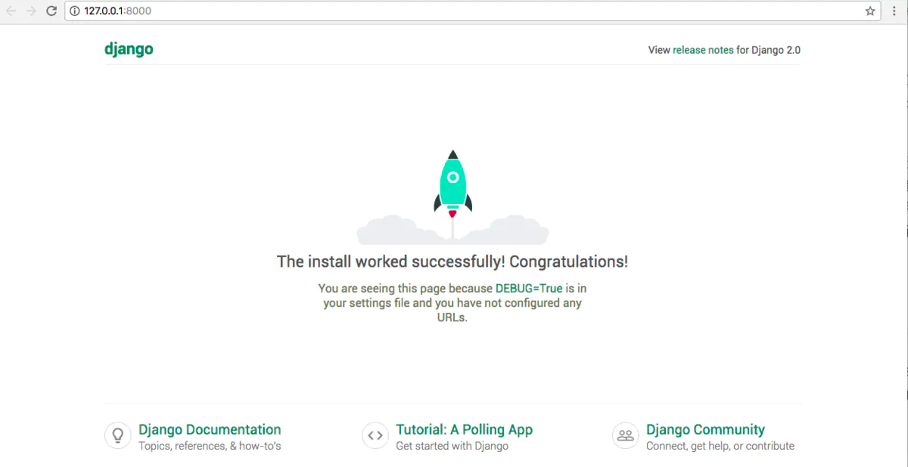


#### 目录结构

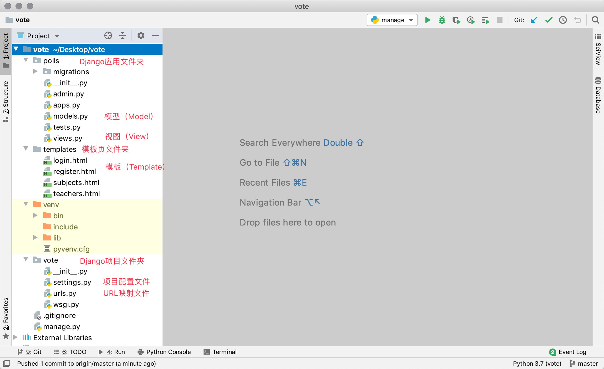

#### 配置文件settings.py
  ```  
    SESSION_COOKINE_AGE=1209600    session过期时间秒
    SESSION_EXPIRE_AT_BROWSER_CLOSE = True  True在关闭浏览器窗口session就过期
    # 配置将会话对象放到缓存中存储
    SESSION_ENGINE = 'django.contrib.sessions.backends.cache'
    # 配置使用哪一组缓存来保存会话
    SESSION_CACHE_ALIAS = 'default'
    SESSION_SERIALIZER = 'django.contrib.sessions.serializers.PickleSerializer'
```
```Python
'''
配置数据库
以下配置，一定要注意键名：NAME、USER、PASSWORD……  都一定是大写，否则数据验证会失败。
'''
DATABASES = {
    'default': {
        #数据库引擎配置
        'ENGINE': 'django.db.backends.mysql',
        #数据库的名字
        'NAME':'vote',
        #数据库服务器ip地址
        'HOST':'47.98.101.50',
        #启动Mysql服务端口号
        'PORT':'3306',
        #数据库用户名和口令
        'USER':'hellokitty',
        'PASSWORD':'Hellokitty.618',
        #数据库使用的字符集
        'CHARSET':'utf8',
        #数据库时间日期的时区设置
        'TIME_ZONE':'Asia/ChongQing',
    }
}

# 地区
LANGUAGE_CODE = 'zh-hans'
TIME_ZONE = 'Asia/Chongqing'

# 配置静态文件
STATICFILES_DIRS = [os.path.join(BASE_DIR, 'static'), ]
STATIC_URL = '/static/'
```

### 路由配置：
```python
urlpatterns = [
    path('hello/', views.show_index),
    path('time/',views.get_time),


    # 带正则的请求
    # 已articles开头/4位0-9数字组成结尾
    re_path(r'^articles/([0-9]{4})/$',views.year_archive),
    # 给参数设置名字 ?P<year>
    re_path(r'^articles/(?P<year>[0-9]{4})/(?P<month>[0-9]{2})/$',views.year_month),
    re_path(r'^articles/([0-9]{4})/([0-9]{2})/([0-31]{2})/$',views.year_month_day),
]


```


### URL分发
#### url.py
```Python
urlpatterns = [
    path('admin/', admin.site.urls),
    path('', register),
    path('teachers/',show_teachers),
    path('criticize/', praise_or_criticize),
    path('praise/',praise_or_criticize),
    path('login/',login),
    path('logout/',logout),
    path('captcha/',get_captcha),
    re_path(r'^',include('mystie.urls'))
]

# 应用中urls.py
urlpatterns = [
    path('hello/', views.show_index),
    path('time/',views.get_time),


    # 带正则的请求
    # 已articles开头/4位0-9数字组成结尾
    re_path(r'^articles/([0-9]{4})/$',views.year_archive),
    # 给参数设置名字 ?P<year>
    re_path(r'^articles/(?P<year>[0-9]{4})/(?P<month>[0-9]{2})/$',views.year_month),
    re_path(r'^articles/([0-9]{4})/([0-9]{2})/([0-31]{2})/$',views.year_month_day),
]

```

#### views.py
```Python
def show_index(request):
    fruits =[
        'Apple','Orange','Pitaya','Durian','Mango','Pear','Peach','Grape'
    ]

    selected_fruits = sample(fruits,3)
    #第一个参数request对象
    #第二个参数返回需要渲染静态网页名字
    #第三个返回需要渲染到页面数据
    return render(request, 'mystie/index.html', {'fruits':selected_fruits})

def get_time(request):
    time = datetime.now()
    return render(request,'mystie/time.html',{'time':time})
```

#### models.py
```python
class User(models.Model):
    no = models.AutoField(primary_key=True,verbose_name='编号')
    username = models.CharField(max_length=20, unique=True, verbose_name='用户名')
    password = models.CharField(max_length=32,verbose_name='密码')
    tel = models.CharField(max_length=20, verbose_name='手机号')
    reg_date = models.DateTimeField(auto_now_add=True, verbose_name='注册时间')
    last_visit = models.DateTimeField(null=True, verbose_name='最后登录时间')

    class Meta:
        db_table = 'tb_user'
        verbose_name = '用户'
        verbose_name_plural = '用户'
```

### URL反向解析
    1、定义：
        随着功能的增加会出现更多的视图，可能之前配置的正则表达式不够准确，于是就要修改正则表达式，但是正则表达式一旦修改了，之前所有对应的超链接
        都要修改，真是一件麻烦的事情，而且可能还会漏掉一些超链接忘记修改，有办法让链接根据正则表达式动态生成吗？ 就是用反向解析的办法。
        
    2、使用方法：
        定义url时，需要为include定义namespace属性，为url定义name属性
        使用时，在模板中使用url标签，在视图中使用reverse函数，根据正则表达式动态生成地址，减轻后期维护成本。

#### 在应用的mystie/urls.py中为url定义name属性，并修改为ye。
``` python
re_path(r'^articles/([0-9]{4})/$',views.year_archive,name='ye'),
 ```    

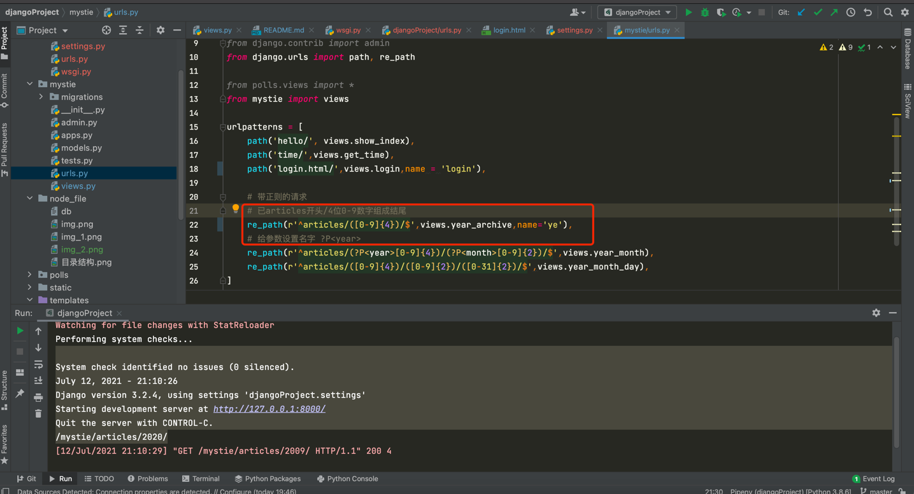

#### 在html模版中使用URL别名
 ```  html
 <form action= method="post">
        <div>
            <label for="username">用户名</label>
            <input name="username" type="text" >
        </div>
        <div>
            <label for="password">密码</label>
            <input type="password" name="pwd">
        </div>
        <div class="c3-1">
            <input type="submit" value="登录">
        </div>
    </form> 
 ```   
#### 在视图中使用重定向传递位置参数
```   python
    from django.shortcuts import render
    
    def year_archive(request,year):
        #使用重定向传递位置参数
        url = reverse('ye',args=(2020,))
        print(url)
        return HttpResponse(year)
 ```   


### 名称空间

###### 命名空间（英语：Namespace）是表示标识符的可见范围。一个标识符可在多个命名空间中定义，它在不同命名空间中的含义是互不相干的。这样，在一个新的命名空间中可定义任何标识符，它们不会与任何已有的标识符发生冲突，因为已有的定义都处于其它命名空间中。

#### 创建两个应用mystie、model,为两个应用的url设置name属性为index
mystie/urls.py
 ```   python
re_path(r'^index/',views.index,name = 'index')

```
mystie/views.py
 ```   python
def index(request):
    return HttpResponse(reverse('index'))
```

model/urls.py
 ```   python
re_path(r'^index/',views.index,name = 'index')
```  
model/views.py
 ```   python
def index(request):
    return HttpResponse(reverse('index'))
```  
访问 127.0.0.1:8000/model/index/

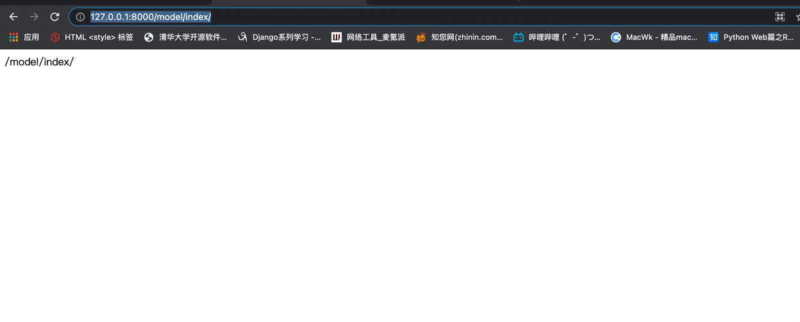

访问 127.0.0.1:8000/mystie/index/

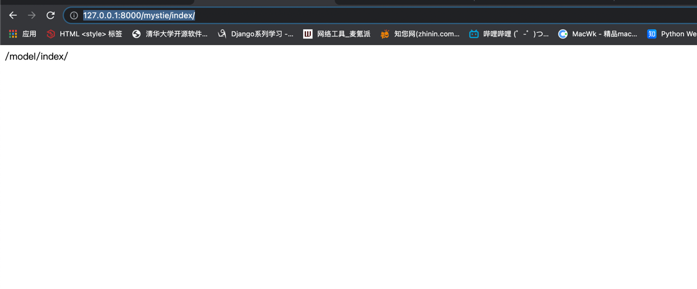

###### 由于name没有作用域，Django在反解URL时，会在项目全局顺序搜索，当查找到第一个name指定URL时，立即返回我们在开发项目时， 会经常使用name属性反解出URL， 当不小心在不同的app的urls中定义相同的name时，可能会导致URL反解错误，为了避免这种事情发生， 引入了命名空间。

#### 在Django项目urls.py中为include定义namespace属性。
``` python
  # 使用分发
    re_path(r'^mystie/',include(('mystie.urls','mystie' ))),
    re_path(r'^model/',include(('model.urls','model'))),
```
修改mystie/views.py
```python
def index(request):
    return HttpResponse(reverse('mystie:index'))
```

修改model/views.py
```python
def index(request):
    return HttpResponse(reverse('model:index'))
```

### django内置转换器
#### converters源码
```  python
class IntConverter:
    regex = '[0-9]+'

    def to_python(self, value):
        return int(value)

    def to_url(self, value):
        return str(value)


class StringConverter:
    regex = '[^/]+'

    def to_python(self, value):
        return value

    def to_url(self, value):
        return value


class UUIDConverter:
    regex = '[0-9a-f]{8}-[0-9a-f]{4}-[0-9a-f]{4}-[0-9a-f]{4}-[0-9a-f]{12}'

    def to_python(self, value):
        return uuid.UUID(value)

    def to_url(self, value):
        return str(value)
    
```  
1、path
```  python
    path('student/<path:p>', views.stu_path),
 ```  
2、int
 ```  python
    path('student/<int:id>', views.student),
 ```  

#### 总结：django中有5中内置转换器
    str：除了斜杠/以外所有的字符都是可以的 。 默认转换器
    int：只有是一个或者多个的阿拉伯数字。
    path：所有的字符都是满足的。
    uuid：只有满足uuid形式的字符串才行。
    slug：英文中的横杆或者英文字符或者阿拉伯数字或者下划线才满足。
    
### 自定义转换器
1、创建一个自定义converter类

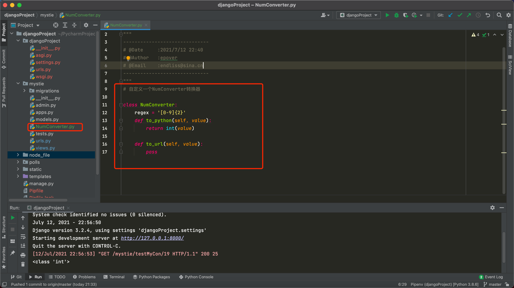

NumConverter.py
  ```   python
  class NumConverter:
    regex = '[0-9]{2}'
    def to_python(self, value):
        return int(value)

    def to_url(self, value):
        pass
  
  ```
2、注册自定义转换器
urls.py
  ```   python
register_converter(NumConverter,'mynum')
```

3、使用自定义转换器
  ```   python
path('testMyCon/<mynum:id>',views.testMyCon),
```

4、访问

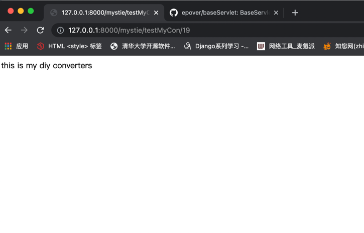

### 视图层响应请求
#### 第一种HttpResponse
  ``` python
    def index(request):

    return HttpResponse('<p1>OK</p1>')
  ```
访问 127.0.0.1:8000/model/index/

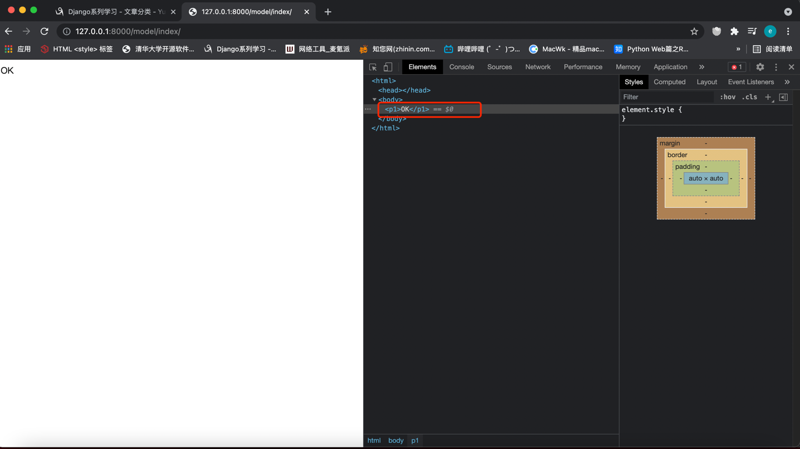

#### 第二种通过rander渲染
 ```python
def login(request):
    return render(request,'model/login.html')
 ```
访问 127.0.0.1:8000/model/login/

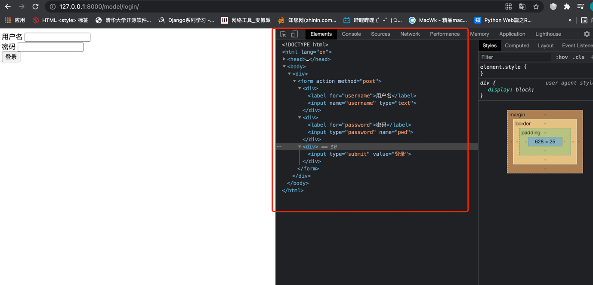


### request请求对象
 ```python
def login(request):
    print('请求方法：',request.method)
    print('path:',request.path)
    print('path_info:',request.path_info)
    print('GET:',request.GET)
    print('POST:',request.POST)
    return render(request,'model/login.html')
 ```
访问 127.0.0.1:8000/model/login/

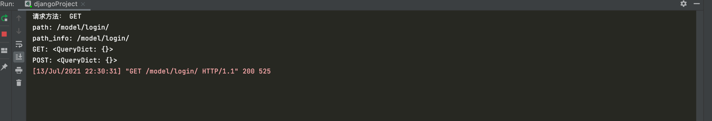

访问 127.0.0.1:8000/model/login/?name='endless' & age = 22

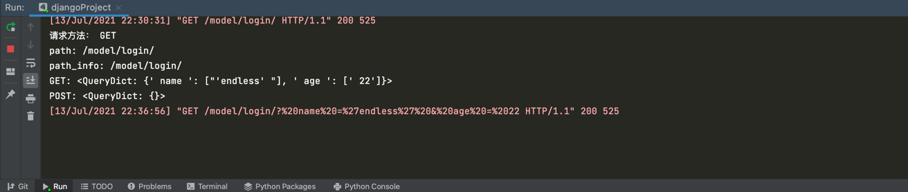

当点击登录时将发起post

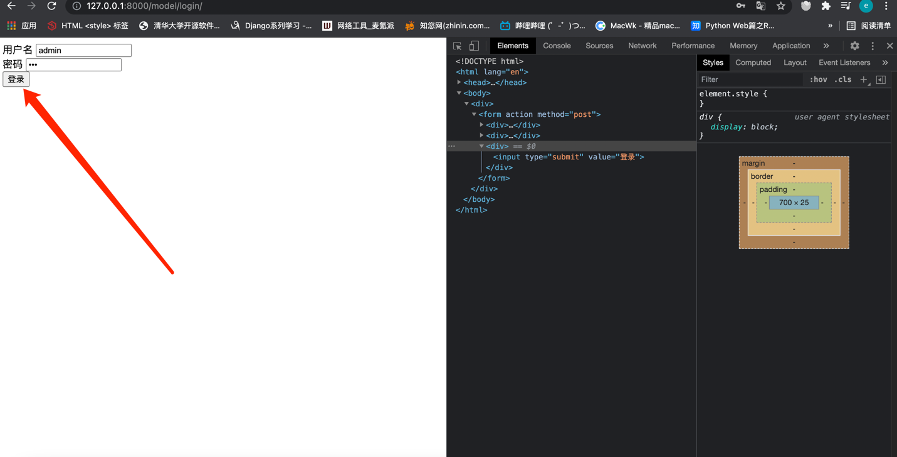

控制台输出

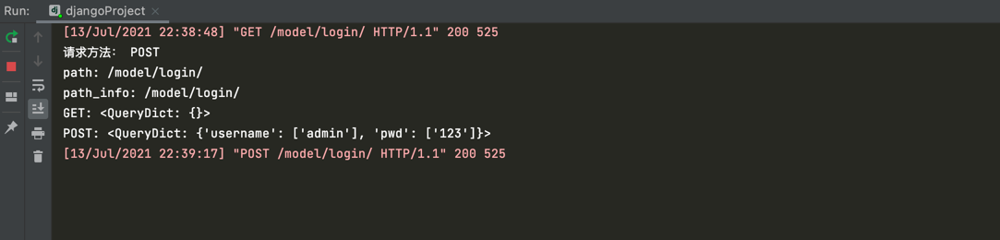

### 模版语法

###### 只要是在html里面有模板语法就不是html文件了，这样的文件就叫做模板。

#### Django中模版语法只有两种写法
    1、{{ }} 
    2、 
```python
def index(request):

    class Person(object):
        def __init__(self,name,age):
            self.name = name
            self.age = age

    jack = Person('jack',23)
    info = {'name': 'tom', 'job':'python'}
    return render(request,'model/index.html',{'jack':jack,'info':info})
```
##### 使用这样字典方式传入参数，如果有1000个那么怎么办？

###### 我们可以使用Django中的locals()函数，locals() 函数会以字典类型返回当前位置的全部局部变量。

```python
def index(request):

    class Person(object):
        def __init__(self,name,age):
            self.name = name
            self.age = age

    jack = Person('jack',23)
    info = {'name': 'tom', 'job':'python'}
    end = Person('endless', 22)
    b = True
    person_list = [jack, end]
    p = '<h2>hello world</h2>'
    list_t = [1, 2, 6, 7, 22, 90]
    return render(request, 'model/index.html', locals())
```

在模版文件中引用变量

```html
<html lang="en">
<head>
    <meta charset="UTF-8">
    <title>Title</title>
</head>
<body>
    <p>
        {{ info }}
    </p>
    <p>
        {{ jack }}
    </p>
    <p>
        {{ person_list }}
    </p>
    <br/>
    <h1>{{ b }}</h1>
    <p>
        {{ list_t }}
    </p>
</body>
</html>
```

访问 127.0.0.1:8000/model/index/

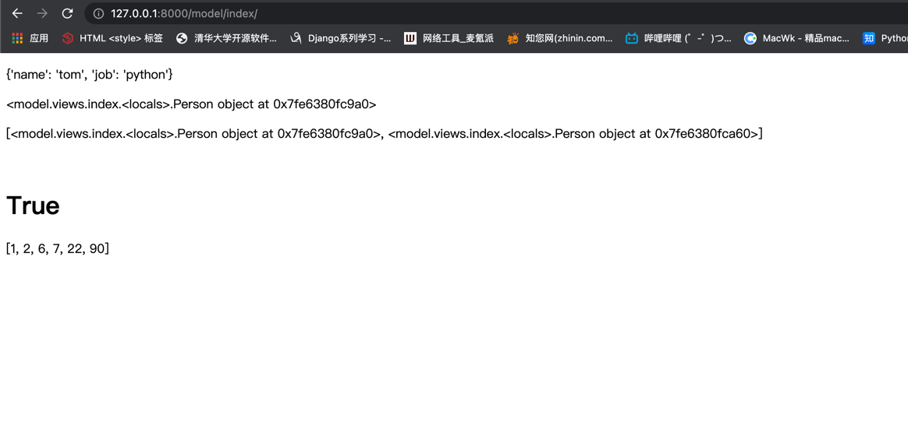

**模版文件中获取变量的值**
```html
<!DOCTYPE html>
<html lang="en">
<head>
    <meta charset="UTF-8">
    <title>Title</title>
</head>
<body>
    <p>
        姓名：{{ info.name }} &nbsp; 年龄：{{ info.age }}
    </p>
    <p>
        {{ jack.age }}
    </p>
    <p>
        person_list.1.name : {{ person_list.1.name}}
    </p>
    <br/>
    <h1>{{ b }}</h1>
    <p>
        {{ list_t.0 }}
    </p>
</body>
</html>
```

##### 返回结果

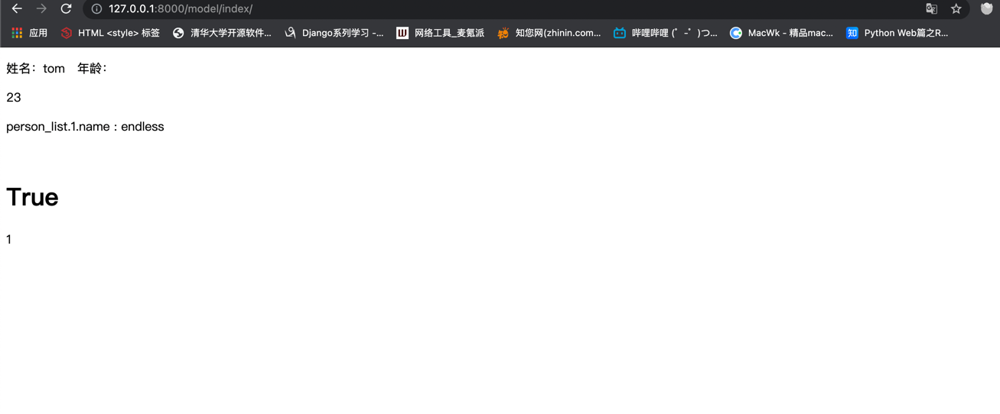

#### 过滤器

###### 常用过滤器：random、filesizeformat、truncatechars、date、safe、upper
```html
<html>
    <body>
        <h1>Django 内置过滤器 </h1>
        <p>{{ size_file|filesizeformat }}</p>
        <p>{{ Django_text|truncatechars:'10' }}</p>
        <p>{{ ctime|date:'Y-m-d h:m:s'}}</p>
        <p>{{ p |safe}}</p>
    </body>
</html>
```

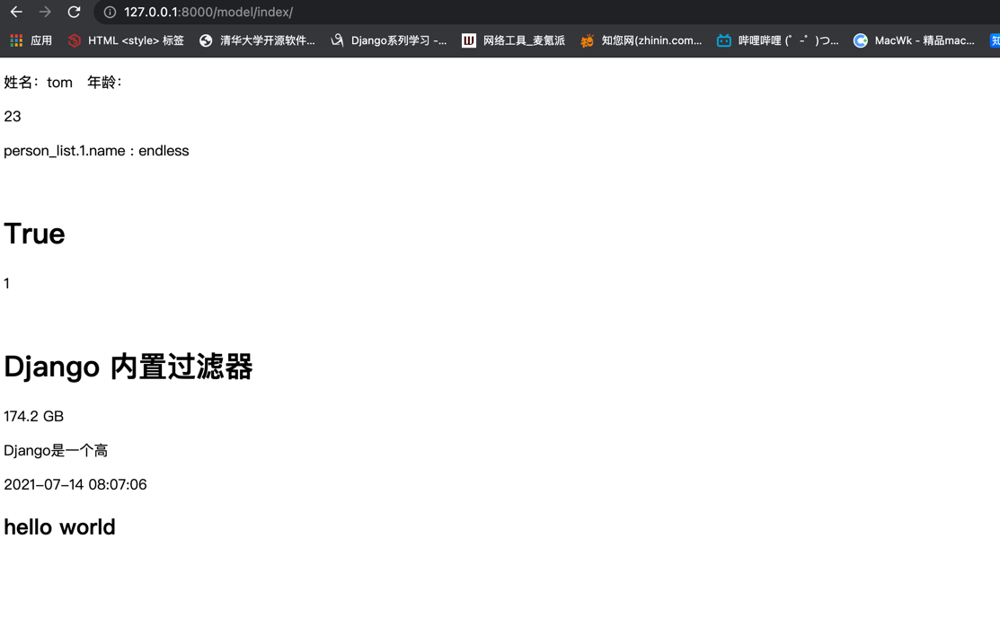

**CSRF**

###### 跨站请求伪造（英语：Cross-site request forgery），也被称为 one-click attack 或者 session riding，通常缩写为 CSRF 或者 XSRF， 是一种挟制用户在当前已登录的Web应用程序上执行非本意的操作的攻击方法。[1] 跟跨网站脚本（XSS）相比，XSS 利用的是用户对指定网站的信任，CSRF 利用的是网站对用户网页浏览器的信任。

解决csrf在模版文件中加入

```html
   
```

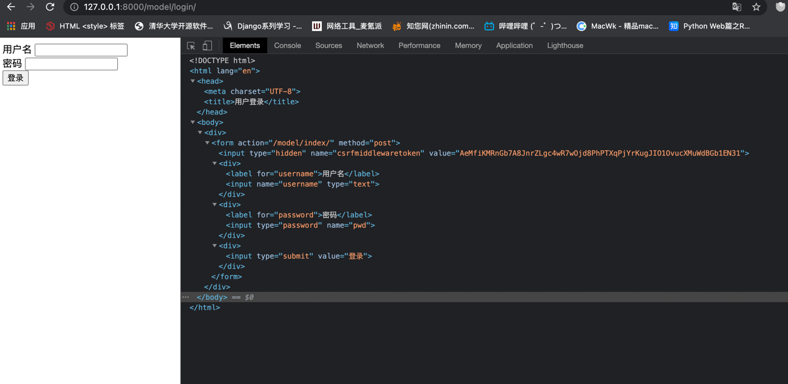

###### 模板指令为表单添加一个隐藏域（大家可以在浏览器中显示网页源代码就可以看到这个指令生成的type属性为hidden的input标签），它的作用是在表单中生成一个随机令牌（token）来防范跨站请求伪造（简称为CSRF），这也是Django在提交表单时的硬性要求。如果我们的表单中没有这样的令牌，那么提交表单时，Django框架会产生一个响应状态码为403的响应（禁止访问），除非我们设置了免除CSRF令牌。下图是一个关于CSRF简单生动的例子。

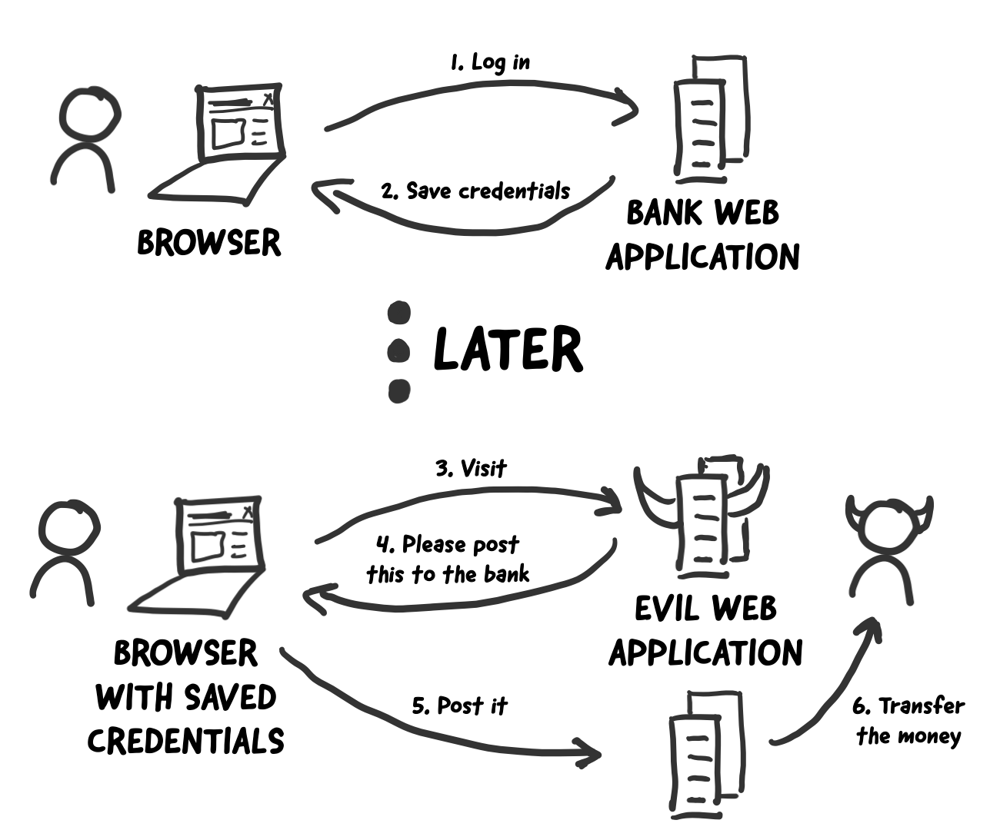

###### 来源骆昊https://github.com/epover/Python-100-Days/

### 标签
#### for循环
```html
    <p>
        
            <p>{{ i }}</p>
        
    </p>
    </p> <p>
        
            <p>{{ i }}</p>
        
    <p>
        
            <p>{{ forloop.counter}}{{  p.name}}    {{  p.age}}</p>
        
            <p>列表为空</p>
        
    </p>
```

###### 响应效果

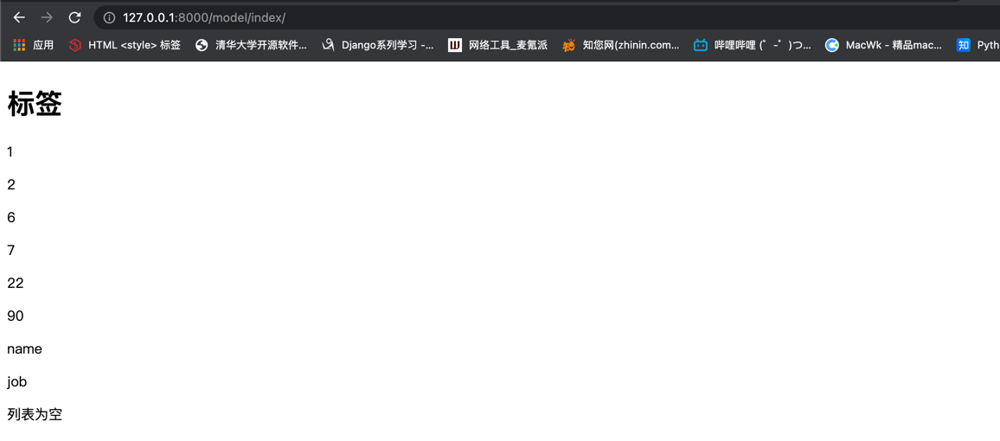

### if else
```html
 <p>
        
            <P>yes {{ info.name }}</P>
        
            <p>no </p>
        
    </p>
    <p>
        
            <h4>Hi{{ name }}</h4>
            <a href="">注销</a>
        
            <a href="">登录</a>
        
 </p>
```
###### 响应效果

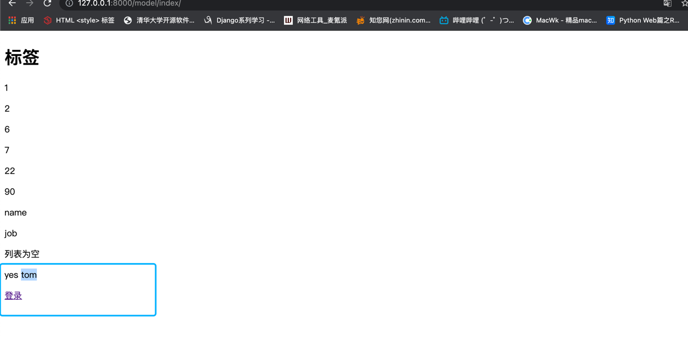


### 自定义过滤器、标签

###### Django虽然为我们内置了二十多种标签和六十多种过滤器，但是需求是各种各样的，总有一款你cover不到。Django为我们提供了自定义的机制，可以通过使用Python代码，自定义标签和过滤器来扩展模板引擎，然后使用标签加载它们。

#### 1.安装app

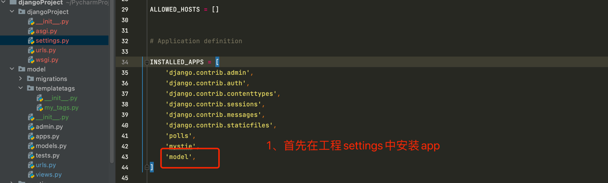

#### 2.在app中创建templatetags文件夹，下面创建自己的py文件

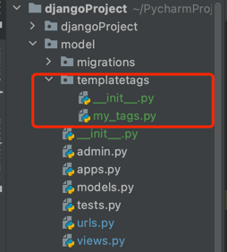

```python
from django import template
# register是唯一的
register = template.Library()

# 注册过滤器
@register.filter
def multi_filter(x,y):
    return x*y

# 注册标签
@register.simple_tag
def multi_tag(x,y,z):
    return x*y*z
```
### 3.在模版文件中引入自己的标签过滤器文件
```html

```
### 4.使用过滤器和标签
```html
<h1>自定义标签和过滤器</h1>
    
    <p>
        {{ num|multi_filter:10 }}
    </p>
    <p>
        
    </p>
```

响应结果

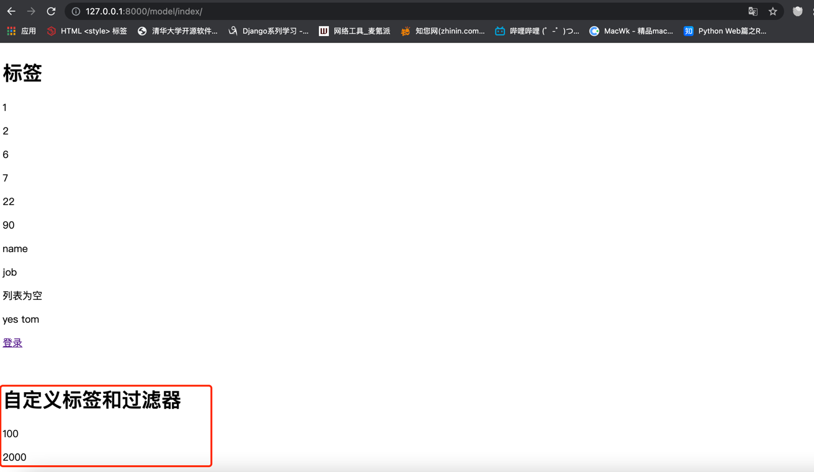


# 使用ORM来解决数据持久化问题

### 什么是ORM？

###### 使用面向对象编程，来操作关系型数据库。


### 简单说，ORM 就是通过实例对象的语法，完成关系型数据库的操作的技术，是"对象-关系映射"（Object/Relational Mapping） 的缩写。

ORM 把数据库映射成对象。

    数据库的表（table） --> 类（class）
    记录（record，行数据）--> 对象（object）
    字段（field）--> 对象的属性（attribute）

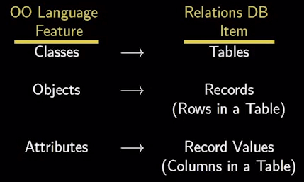

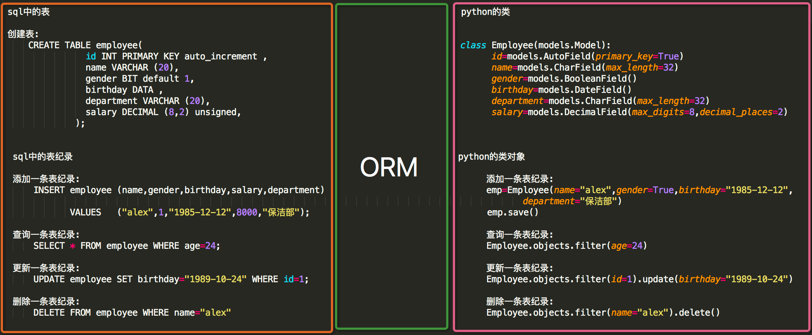

###### 如果还是不能理解那么可以看阮一峰讲解的ORM 实例教程http://www.ruanyifeng.com/blog/2019/02/orm-tutorial.html

#### 在shell中使用orm模型完成CRUD
   ``` 
    python manage.py shell
   ```

```python
from polls.models import Subject

subject1 = Subject(name='Python全栈开发', intro='当下最热门的学科', is_hot=True)
subject1.save()
subject2 = Subject(name='全栈软件测试', intro='学习自动化测试的学科', is_hot=False)
subject2.save()
subject3 = Subject(name='JavaEE分布式开发', intro='基于Java语言的服务器应用开发', is_hot=True)
删除
subject = Subject.objects.get(no=2)
subject.delete()
更新
subject = Subject.objects.get(no=1)
subject.name = 'Python全栈+人工智能'
subject.save()
查询
查询所有对象。
Subjects.objects.all()
过滤数据。
# 查询名称为“Python全栈+人工智能”的学科
Subject.objects.filter(name='Python全栈+人工智能')

# 查询名称包含“全栈”的学科（模糊查询）
Subject.objects.filter(name__contains='全栈')
Subject.objects.filter(name__startswith='全栈')
Subject.objects.filter(name__endswith='全栈')

# 查询所有热门学科
Subject.objects.filter(is_hot=True)

# 查询编号大于3小于10的学科
Subject.objects.filter(no__gt=3).filter(no__lt=10)
Subject.objects.filter(no__gt=3, no__lt=10)

# 查询编号在3到7之间的学科
Subject.objects.filter(no__ge=3, no__le=7)
Subject.objects.filter(no__range=(3, 7))
查询单个对象。
# 查询主键为1的学科
Subject.objects.get(pk=1)
Subject.objects.get(no=1)
Subject.objects.filter(no=1).first()
Subject.objects.filter(no=1).last()
排序。
# 查询所有学科按编号升序排列
Subject.objects.order_by('no')
# 查询所有部门按部门编号降序排列
Subject.objects.order_by('-no')
切片（分页查询）。
# 按编号从小到大查询前3个学科
Subject.objects.order_by('no')[:3]
计数。
# 查询一共有多少个学科
Subject.objects.count()
高级查询。
# 查询编号为1的学科的老师
Teacher.objects.filter(subject__no=1)
Subject.objects.get(pk=1).teacher_set.all()

# 查询学科名称有“全栈”二字的学科的老师
Teacher.objects.filter(subject__name__contains='全栈')

###### 安装pymysql驱动
```text
pip install pymysql
```

###### 在APP配置ORM/init.py文件中写入：
```
import pymysql
pymysql.install_as_MySQLdb()
``` 

###### 在settings.py中安装app
```python
INSTALLED_APPS = [
    'django.contrib.admin',
    'django.contrib.auth',
    'django.contrib.contenttypes',
    'django.contrib.sessions',
    'django.contrib.messages',
    'django.contrib.staticfiles',
    'ORM',
]
```

###### 在ORM/models.py中创建类
```python
from django.db import models
class Book(models.Model):
    no = models.AutoField(primary_key=True,verbose_name="no")
    title = models.CharField(max_length=32,unique=True) #unique唯一性
    pub_date = models.DateField()
    price = models.DecimalField(max_digits=8,decimal_places=2)  #999999.99
    press = models.CharField(max_length=32)
```

###### 执行orm对象模型到关系模型转换（将类转换成sql）
 ```
python manage.py makemigrations
python manage.py migrate
 ```  

#### python manage.py makemigrations

######  这个命令是记录我们对models.py的所有改动，并且将这个改动迁移到migrations这个文件下生成一个文件例如：0001文件，如果你接下来还要进行改动的话可能生成就是另外一个文件不一定都是0001文件，但是这个命令并没有作用到数据库

#### python manage.py migrate

###### 这条命令的主要作用就是把这些改动作用到数据库也就是执行migrations里面新改动的迁移文件更新数据库，比如创建数据表， 或者增加字段属性

**注意：另外一个需要注意的是这两个命令默认情况下是作用于全局，也就是对所有最新更改的models或者migrations下面的迁移文件进行对应的操作，
如果要想仅仅对部分app进行作用的话  则执行如下命令：**
```
python manage.py makemigrations appname,
python manage.py migrate appname,
如果要想精确到某一个迁移文件则可以使用：
python manage.py migrate appname 文件名
```

###### 反向生成

    python manage.py inspectdb > polls/models.py

### 对数据库进行操作
常用查询方法：

    <1> all():                 查询所有结果
     
    <2> filter(**kwargs):      它包含了与所给筛选条件相匹配的对象
     
    <3> get(**kwargs):         返回与所给筛选条件相匹配的对象，返回结果有且只有一个，如果符合筛选条件的对象超过一个或者没有都会抛出错误。
     
    <4> exclude(**kwargs):     它包含了与所给筛选条件不匹配的对象
     
    <5> values(*field):        返回一个ValueQuerySet——一个特殊的QuerySet，运行后得到的并不是一系列model的实例化对象，而是一个可迭代的字典序列
     
    <6> values_list(*field):   它与values()非常相似，它返回的是一个元组序列，values返回的是一个字典序列
     
    <7> order_by(*field):      对查询结果排序
     
    <8> reverse():             对查询结果反向排序，请注意reverse()通常只能在具有已定义顺序的QuerySet上调用(在model类的Meta中指定ordering或调用order_by()方法)。
     
    <9> distinct():            从返回结果中剔除重复纪录(如果你查询跨越多个表，可能在计算QuerySet时得到重复的结果。此时可以使用distinct()，注意只有在PostgreSQL中支持按字段去重。)
     
    <10> count():              返回数据库中匹配查询(QuerySet)的对象数量。
     
    <11> first():              返回第一条记录
     
    <12> last():               返回最后一条记录
     
    <13> exists():             如果QuerySet包含数据，就返回True，否则返回False
    


#### 1、添加数据
```python
    # 第一种方法
     book = models.Book(title='JAVA编程思想',pub_date='2020-12-3',press='人民出版社',price=89)
     book.save()
    # 第二种方法
     book2 = models.Book.objects.create(title='RESTful API 设计指南',pub_date='2021-7-9',press='中国邮电出版社',price=199)
     print(book.price)
     print(type(book))
```
控制台输出： 

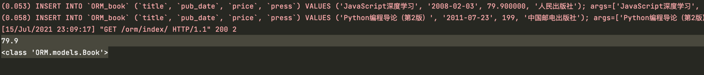

#### 2、查询

###### all()
```python
    # 查询所有
     book = models.Book.objects.all()[1]
     print(book)
     for i in book:
        print(i.title)
     # <class 'django.db.models.query.QuerySet'>
     print(type(book))
```
控制台输出：

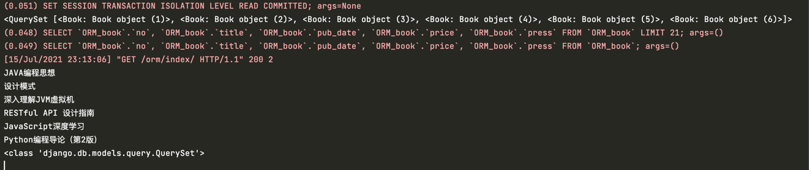

###### filter()
```python
    # 查询filter
     book = models.Book.objects.filter(title='设计模式')
     print(book[0].title)
     print(type(book))
```
控制台输出：

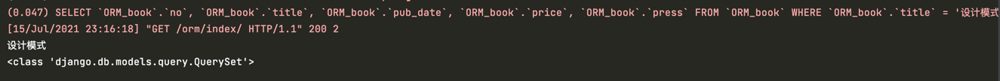

###### get()

```python
    # 查询get 智能返回唯一一个对象
    book = models.Book.objects.get(no=2)
    print(type(book))
    print(book.title)
```
控制台输出：

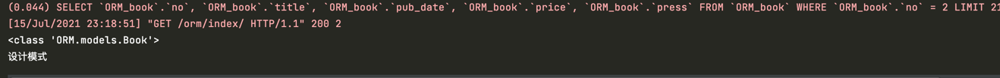

###### values()
```python
# values()
    book = models.Book.objects.values('price')
    # <QuerySet [{'price': Decimal('89.00')}, {'price': Decimal('58.00')}, {'price': Decimal('109.00')}, {'price': Decimal('199.00')}, {'price': Decimal('79.90')}, {'price': Decimal('199.00')}]>
    print(book)
```

###### values_list()
```python
    book = models.Book.objects.values_list('price')
     # <QuerySet [(Decimal('89.00'),), (Decimal('58.00'),), (Decimal('109.00'),), (Decimal('199.00'),), (Decimal('79.90'),), (Decimal('199.00'),)]>
    print(book)
```

###### count()
```python
    print(models.Book.objects.count())
```

###### exists() 有记录返回True，没有记录返回flase
```python
     if models.Book.objects.exists():
            temp = 'ok'
     else:
        temp = 'NO'
    return HttpReponse(temp)
```

###### distinct()
```python
    book = models.Book.objects.values('price').distinct()
    print(book)
```

###### exclude() 过滤掉'设计模式'
```python
    book = models.Book.objects.exclude('设计模式')
    print(book)
```

###### orader_by()
```python
    # 升序
    book = models.Book.objects.orader_by('price')
    # 降序 
    book = models.Book.objects.orader_by('-price')
```

###### 模糊查询

```python
    # 模糊查询
    # __startswith():以p开头;istartswith:不区分大小写
    book_p = models.Book.objects.filter(title__istartswith='p')
    print(book_p.values('title'))

    #endswith()：以什么结尾的
    book = models.Book.objects.filter(title__endswith='2')
    print(book.values('title'))

    # contains() 包含什么内容的
    book = models.Book.objects.filter(title__icontains='hp')
    print(book.values('title'))

    # __year 对日期查询
    book = models.Book.objects.filter(pub_date__year=2021)
    print(book.values('title'))

    #__in=[48,98] 查询包含48，98的
    book = models.Book.objects.filter(price__in=[48,98,199])
    print(book.values('title'))

    # __gt 大于 __lt小于
    print(models.Book.objects.filter(price__gt=100).values('price'))
    print(models.Book.objects.filter(price__lt=100).values('price'))

    # __range=[10,100] 介于之间
    print(models.Book.objects.filter(price__range=[10,100]).values('price'))
```

###### 删除数据
```python
    # delete() 删除返回：(1, {'ORM.Book': 1}) 删除记录，表名，
    ret = models.Book.objects.filter(title='php').delete()
    print(ret)
```
###### 更新数据
```python
    # .update() 更新数据
    ret = models.Book.objects.filter(title='php3').update(title='php')
    print(ret)
```

### ORM模型类生成多表关系

#### 多表的关系是什么？

###### 在实际的开发过程中，项目一定是有多张表的，且这些表之间都是有关系的
表于表之间的关系分类为一下三种：
```text
1、一对一
    学生表
    学号
    姓名
一卡通表
    id
    姓名
    金额
```

###### 学生表对应一卡通的一行，反之也成立，两张表可以合并成一张表，这就是一对一

```text
2、一对多
图书表
    书名
    价格
    出版社
    出版时间
    出版社（出版社id）
    
出版社表
    id
    名字
    城市
    邮箱
```

###### 一本图书只能对应一个出版社，但是一个出版社对应很多本图书

```text
3、多对多
图书表
    书名
    价格
    出版社
    出版时间
    作者（作者id）
作者表
    姓名
    年龄
    地址
    出版过的书籍（图书ID）
```

###### 图书表对应作者表的多行数据（一个图书可能是多个作者编写）；作者表对应图书表多本图书，（一个作者能写很多本书籍）。

> ##### **[如果对于SQL不太了解，推荐看廖雪风SQL教程](https://www.liaoxuefeng.com/wiki/1177760294764384)**


#### 介绍完了多表的关系，接下来我们开始使用ORM模型来对多表进行操作

###### 在ORM模型中一对一关系OneToOneField建立，一对多关系ForeignKey建立，多对多关系ManyToManyField建立

```python
# 作者表
class Author(models.Model):
    id = models.AutoField(primary_key=True)
    name = models.CharField(max_length=32)
    age = models.IntegerField()

    # 与AuthorDetail建立一对一的关系，会自动生成一个authorDetail+'_id'的对应关系字段
    authorDetail =  models.OneToOneField(to="AuthorDetail",on_delete=models.CASCADE)
```

```python
# 作者详情表 
class AuthorDetail(models.Model):
    id = models.AutoField(primary_key=True)
    birthday = models.DateField()
    telephone = models.BigIntegerField()
    addr = models.CharField(max_length=64)
```

```python
# 出版社详情
class Publish(models.Model):
    id = models.AutoField(primary_key=True)
    name = models.CharField(max_length=32)
    city = models.CharField(max_length=32)
    email = models.EmailField()
```

```python
# 建立图书表
class Books(models.Model):
    id = models.AutoField(primary_key=True,verbose_name='图书id') #verbose_name：详细信息
    title = models.CharField(max_length=32)
    publishDate = models.DateField()
    '''
    DecimalField
        固定精度的十进制数，在Python中表示一个 十进制的实例
        #1. DecimalField max_digits 
        　　数中允许的最大数目的数字
        #2. DecimalField decimal_places 
　           　存储的小数位数的位数   
    '''
    price = models.DecimalField(max_digits=5,decimal_places=2)


    # 与出版社表建立一对多的关系，外键字段建立在多的一方，会生成一个以publish+'_id'来对应关系的字段
    publish = models.ForeignKey(to='Publish',to_field='id',on_delete=models.CASCADE)

    # 与作者表建立多对多的关系，ManyToManyField可以建立在两个模型中的任意一个，自动创建第三张表
    Authors = models.ManyToManyField(to='Author')
```

### 多表记录操作

###### 一对一表添加数据
```python
    # 一对一 插入作者
    # 返回添加记录对象
    authorDetail= AuthorDetail.objects.create(birthday='1998-12-28',telephone='911',addr='四川成都')
    print(authorDetail)
    author = Author.objects.create(name='Endless',age=23,authorDetail=authorDetail)
    print(author)
```

###### 一对多添加数据
```python
    # 一对多关系数据表插入
    book = Books.objects.create(title='python',price=18,publishDate='2019-12-06',publish_id=1)
    print(book)
    # 通过publish_id=1，ORM帮我们拿到publish对象
    print(book.publish.city)

    # 第二种方式实现一对多
    # 查询id=1的出版社
    publish = Publish.objects.filter(id=1).first()
    book = Books.objects.create(title='Django',price=53,publishDate='2021-4-30',publish=publish)
    print(book)
    #  直接能拿到与之关联的数据对象，publish对象
    print(book.publish)
    
    # 查询出JAVA设计模式的出版社邮箱
    email = Books.objects.filter(title='JAVA设计模式').first().publish.email
    print(email)
```

###### 多对多第三张表添加数据
```python
    # 一对多插入
    book = Books.objects.create(title='RESTFUL API',price=58,publishDate='2008-05-06',publish_id=2)
    # 添加第三张表关联数据
    book.Authors.add(1)
```


### Django模型最佳实践
```
    正确的为模型和关系字段命名。
    设置适当的related_name属性。
    用OneToOneField代替ForeignKeyField(unique=True)。
    通过“迁移操作”（migrate）来添加模型。
    用NoSQL来应对需要降低范式级别的场景。
    如果布尔类型可以为空要使用NullBooleanField。
    在模型中放置业务逻辑。
    用<ModelName>.DoesNotExists取代ObjectDoesNotExists。
    在数据库中不要出现无效数据。
    不要对QuerySet调用len()函数。
    将QuerySet的exists()方法的返回值用于if条件。
    用DecimalField来存储货币相关数据而不是FloatField。
    定义__str__方法。
    不要将数据文件放在同一个目录中。
```
### 实现用户跟踪
```
    URl重写：所谓URL重写就是在URL中携带sessionid
    隐藏域：在提交表单时，通过表单中设置隐藏域向服务器发送数据
        <input type="hidden" name="sessionid" value="123456">
    本地存储
        Local Storage
        Session Storage
        IndexedDB
        Web SQL
        Cookies
```


> ### 推荐阅读：
> ##### [🌳🚀 CS 可视化：有用的 Git 命令](https://github.com/epover/Learn_GitHub/blob/main/%F0%9F%8C%B3%F0%9F%9A%80%20CS%20%E5%8F%AF%E8%A7%86%E5%8C%96%EF%BC%9A%E6%9C%89%E7%94%A8%E7%9A%84%20Git%20%E5%91%BD%E4%BB%A4.md)
